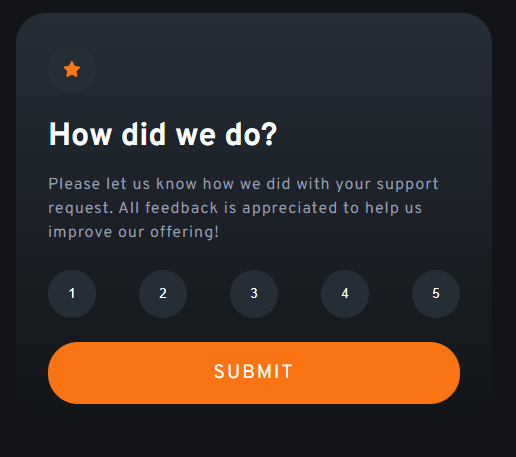

# Frontend Mentor - Product preview card component solution
2
​
3
Yeyyy!!!! My first Frontend Mentor challenge is completed!!!!!
4
This is a solution to the [Product preview card component challenge on Frontend Mentor](https://www.frontendmentor.io/challenges/product-preview-card-component-GO7UmttRfa). Frontend Mentor challenges help you improve your coding skills by building realistic projects. 
5
​
6
## Table of contents
7
​
8
- [Overview](#overview)
9
  - [The challenge](#the-challenge)
10
  - [Screenshot](#screenshot)
11
  - [Links](#links)
12
- [My process](#my-process)
13
  - [Built with](#built-with)
14
  - [What I learned](#what-i-learned)
15
  - [Useful resources](#useful-resources)
16
- [Author](#author)
17
​
18
## Overview
19
​
20
### The challenge
21
​
22
Users should be able to:
23
​
24
- View the optimal layout depending on their device's screen size
25
- See hover and focus states for interactive elements
26
​
27
### Screenshot
28
​
29

30
​
31
### Links
32
​
33
- Solution URL: [https://www.frontendmentor.io/solutions/responsive-product-preview-card-component-with-html-ans-scss-CEZp-fL2tK]
34
- Live Site URL: [https://rickhalmoguera.github.io/product_preview-card-component/]
35
​
36
## My process
37
​
38
### Built with
39
​
40
- Semantic HTML5 markup
41
- SCSS
42
- Flexbox
43
- Mobile-first workflow
44
​
45
### What I learned
46
​
47
Although it is a simple project, it helped me to learn the use of ForEach , which I used to change the states of rating buttons
48
​
49
To see how you can add code snippets, see below:
50
​
51
```Js
52
const checkClick = (ratingClickedId)=>{
53
    const circles= document.querySelectorAll(".rating-btn")
54
    circles.forEach(circle => {
55
        circle.style.backgroundColor ="hsl(213, 19%, 18%)"
56
        circle.style.color ="hsl(217, 12%, 63%)"
57
    });
58
```
59
​
60
### Useful resources
61
​
62
- [JavaScript Array forEach](https://www.w3schools.com/jsref/jsref_foreach.asp) - This helped me to implement the code for the ratings states
63
- [JavaScript Switch Statement](https://www.w3schools.com/js/js_switch.asp) - How to use this statement
64
​
65
## Author
66
​
67
- Github - [Ricardo Halmoguera](https://github.com/RickHalmoguera)
68
- Frontend Mentor - [@RickHalmoguera](https://www.frontendmentor.io/profile/RickHalmoguera)
69
​
70
​
